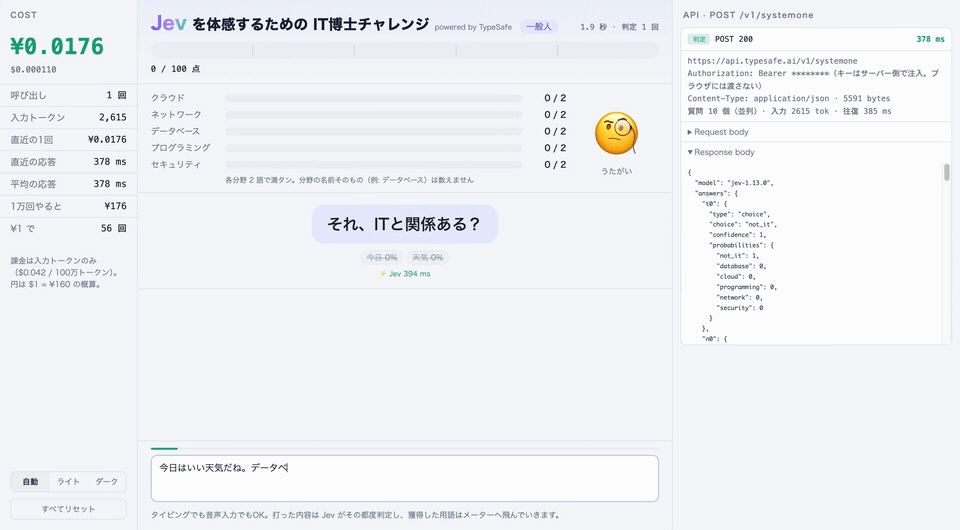
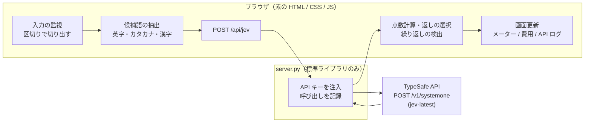

# Jev Buzzword Rush（IT博士チャレンジ）

**Jev がどれくらい速くて安いのかを、25 秒で体感するための小さなゲーム。**

新しい AI の API が「速い」「安い」と聞いても、こうなりがちです。

- curl を 1 回叩いて「ふーん、速いね」で終わる。**実際のアプリで効くのか**が分からない
- 料金表の「$0.042 / 100 万トークン」を見ても、**1 回いくらなのか**ピンとこない
- 「LLM と何が違うの？」に、**手元の実例で答えられない**

そこで、IT 用語を打ち込むたびに Jev が判定してメーターが伸びる、**送信ボタンの無いゲーム**にしました。
入力した端から判定が返り、画面の左にはその場の費用、右には実際に送った HTTP リクエストとレスポンスが流れます。



[全編を見る（33 秒）](docs/demo.mp4)

> 動画の入力はデモの自動再生（`?demo`）で、人の打鍵を模して 1 文字ずつ入れています。
> 判定の速さと費用は実測です。早送りはしていません（先頭 1 秒だけ切っています）。

*English: see [English](#english) below.*

---

## 何をするものか

- IT 用語を打つ（または音声入力で話す）と、Jev が **どの分野の用語か** を判定します
  （クラウド / ネットワーク / データベース / プログラミング / セキュリティ / IT 用語ではない）
- 各分野 2 語で満タン、5 分野すべて満タンでクリア
- 分野の名前そのもの（「データベース」）、既出の語、IT と関係ない話には、それぞれツッコミが返ります
- 用語ごとに「どれくらい現役か」「学習コストが高いか」「通好みか」「豆知識のどれに当たるか」も同時に判定し、返しの一言を選びます
  （「JSP、懐かしい！」「障害の原因、だいたいDNS説」など）

実測（デモ 1 回分）：判定 14 回、平均 **約 400ms**、クリアまでの費用 **約 ¥0.14**（$1 = ¥160 換算）。

## なぜ LLM を使わないのか

**Jev の速さを体感することが目的だから**です。

返しの文章を LLM に生成させると、体感速度は LLM の応答待ちで決まってしまいます。
このゲームでは、文章を一切生成しません。

- **判定は Jev**：分野・現役度・学習コスト・通好み度・豆知識の照合。1 回のリクエストで並列に聞く
- **それ以外はコード**：候補語の切り出し、点数計算、返しの選択、繰り返しの検出

返しの一言は、あらかじめ用意した候補から **Jev の判定結果に応じてコードが選びます**。
豆知識も同じで、「この語はどの技術の名前か」を Jev に **選ばせて**いるだけなので、
「モラクル」のような崩れた表記でも、用意した一言に当たります。

TypeSafe のドキュメントにある「生成ではなく選択」「計算や比較はコードで」「独立した質問はまとめて投げる」を、そのまま実装した例でもあります。

## 動作環境

- Python 3.10 以上（標準ライブラリのみ。`pip install` は不要）
- Chrome などの新しめのブラウザ（`Intl.Segmenter` を使います）
- TypeSafe の API キー（[console.typesafe.ai](https://console.typesafe.ai/keys)。キーの発行にはクレジットの購入が必要です。最低 $5）

## 動かす

API キーは **環境変数 `TYPESAFE_AI_KEY` で外から渡してください。** リポジトリには含めません。

```bash
git clone https://github.com/pochang6/jev-buzzword-rush.git
cd jev-buzzword-rush
TYPESAFE_AI_KEY=xxxxxxxx python3 server.py
# → http://localhost:8787 を開く
```

シークレット管理ツールを使っているなら、その実行ラッパー経由でも構いません（例: `infisical run -- python3 server.py`）。

キーはローカルの中継サーバー（`server.py`）だけが持ち、ブラウザには渡しません。
画面右の API ログでも `Authorization: Bearer ********` と伏せて表示します。

| URL | 何が起きるか |
| --- | --- |
| `http://localhost:8787/` | 自分で打って遊ぶ |
| `http://localhost:8787/?demo` | 台本どおりに 1 文字ずつ自動入力する（デモ用） |
| `http://localhost:8787/?record` | 「録画してデモを始める」ボタンを出す。押すとこのタブだけを録画し、終了後に webm をダウンロード |

## 設定（`web/config.js`）

| 項目 | 既定値 | 何が起きるか |
| --- | --- | --- |
| `GAME.perCategory` | `2` | 1 分野が満タンになる語数 |
| `GAME.threshold` | `0.8` | IT 用語とみなす確率（1 − 「IT 用語ではない」） |
| `GAME.maxCandidates` | `8` | 1 回に判定する候補語の上限（1 語あたり 5 問） |
| `GAME.askRate` | `0.6` | 獲得時に「まだ空の分野のキーワード、何かある？」と促す確率 |
| `LAST_WORD_IDLE_MS` | `1000` | 区切りが無いとき、末尾の語を「言いかけ」とみなして待つ時間 |
| `CHUNK_MAX_CHARS` | `40` | 区切り無しで続いたときに強制的に判定する文字数 |
| `DEMO_SCRIPT` | — | `?demo` の台本 |
| `TRIVIA` | 15 件 | 豆知識の一言。Jev が「どの技術の名前か」を選ぶ |

分野・返しの言い回し・ぽちょ（クマ）の表情も同じファイルにあります。
`web/faces/<表情名>.gif` か `.png` を置くと、絵文字の代わりに表示されます。

## 仕組み



1 語につき 5 つの質問を、1 回のリクエストにまとめて投げます。たとえば「Oracle」と打ったとき（抜粋）：

```json
{
  "model": "jev-latest",
  "state": { "conversation": [ "…直近のやりとり…" ], "segment": "Oracle" },
  "questions": {
    "t0": { "type": "choice",
            "instructions": { "word": "Oracle", "question": "`segment` の中で使われている `word` は、どの分野の IT 専門用語か。…" },
            "criteria": { "cloud": "クラウド: …", "network": "ネットワーク: …", "database": "データベース: …",
                          "programming": "プログラミング: …", "security": "セキュリティ: …",
                          "not_it": "IT の専門用語ではない言葉。…（管理、設定、利用、モデル、基本 など）はこちら" } },
    "n0": { "type": "score", "instructions": { "word": "Oracle", "question": "…どれくらい通好みの用語か。" }, "criteria": [ "…", "…", "…" ] },
    "e0": { "type": "score", "instructions": { "word": "Oracle", "question": "…今どのくらい現役の技術か。" }, "criteria": [ "…", "…", "…", "…" ] },
    "h0": { "type": "noul",  "instructions": { "word": "Oracle", "question": "…学習コストが高いことで知られる技術か。" } },
    "k0": { "type": "choice", "instructions": { "word": "Oracle", "question": "`word` そのものが、次のどの技術の名前か。…" },
            "criteria": { "oracle": "Oracle Database", "cobol": "COBOL", "…": "…", "none": "上のどれでもない" } }
  }
}
```

返ってくるもの（抜粋。386ms、入力 1,642 トークン ≒ ¥0.011）：

```json
{
  "t0": { "type": "choice", "choice": "database", "confidence": 0.99,
          "probabilities": { "database": 0.99, "not_it": 0.01, "cloud": 0.0, "…": 0.0 } },
  "e0": { "type": "score", "score": 1.52, "probabilities": { "0": 0.01, "1": 0.47, "2": 0.52, "3": 0.0 } },
  "h0": { "type": "noul", "noul": 0.55 },
  "k0": { "type": "choice", "choice": "oracle", "confidence": 0.92 }
}
```

コード側はこれを見て、「データベースに +1」「豆知識 oracle の一言を出す」を決めます。

### 作りながら分かったこと

- **前の発言との比較は苦手。** 同じ文をそのまま繰り返しても「繰り返しか」の判定は 0.14 でした。ドキュメントの既知の弱点（間接参照）どおりで、既出の判定はコード側（文字一致・獲得済みの語）に移しました
- **一般語が IT 用語に寄る。** 分野を選ばせると「管理」が 94% で IT 用語扱いになりました。「IT 用語ではない」の説明に例（管理・設定・モデル…）を足すと 40% に下がりました
- **関連語に引っぱられる。** 「DynamoDB」が豆知識の「AWS」に当たったので、「その技術の名前そのものか」を聞くように直しました
- **質問を増やしても遅くならない。** 1 語 1 問でも 5 問でも 350〜490ms。たまに API 側で数秒の遅延が出ることはあります

## ファイル

| パス | 中身 |
| --- | --- |
| `server.py` | 静的ファイルの配信と、`/api/jev` の中継（キーの注入・`logs/server.jsonl` への記録） |
| `web/index.html` | 画面。ライト / ダーク（システム追従と切り替え） |
| `web/app.js` | 入力監視・候補語抽出・判定結果の解釈・描画・録画 |
| `web/config.js` | 分野・閾値・質問文・返し・豆知識・デモ台本 |
| `jev.py` | 1 回の呼び出しをターミナルで見える化する小さなクライアント（`examples/` の JSON を渡す） |

## 免責

個人の実験として作ったものです。無保証で提供します。
不具合の報告は歓迎しますが、対応は約束できません。方針に合わない PR はお断りすることがあります。
API の利用料金は、API キーの持ち主に発生します。`?demo` や `?record` も実際に API を呼びます（1 回あたり約 ¥0.14）。
ブラウザの入力内容は TypeSafe の API に送信され、`logs/` にも記録されます。

## License

[MIT](LICENSE)

---

## English

**A tiny game to feel how fast and cheap Jev (TypeSafe's System One model) is, in about 25 seconds.**

Type (or dictate) IT buzzwords. Every time you hit a space, Jev classifies each new word into one of five categories
(cloud / network / database / programming / security) or "not an IT term", and the word flies into its meter.
Fill all five meters (two words each) to clear. The left pane shows the running cost; the right pane shows the actual
HTTP requests and responses.

- **No LLM on purpose.** Generating text would make the experience as slow as the LLM. Jev only *judges*;
  plain code extracts candidate words, keeps score, detects repeats and picks a canned reaction based on Jev's answers.
- **One request, many questions.** Five questions per word (category, era, learning curve, niche-ness, trivia match)
  are sent together and answered in parallel — about 400ms per request, about ¥0.14 (≈ $0.0009) per full game.
- **Selection, not generation.** Trivia lines are pre-written; Jev only picks which technology a (possibly misspelled) word names.

The UI text is Japanese.

### Run

```bash
TYPESAFE_AI_KEY=xxxxxxxx python3 server.py   # Python 3.10+, standard library only
# open http://localhost:8787  (?demo = scripted autoplay, ?record = record this tab to webm)
```

The key stays in the local proxy (`server.py`) and is never sent to the browser.

### Disclaimer

Personal experiment, provided as is, without warranty. Bug reports are welcome but responses are not guaranteed.
API usage is billed to the owner of the API key; `?demo` and `?record` make real API calls.
Whatever you type is sent to the TypeSafe API and logged locally under `logs/`.
